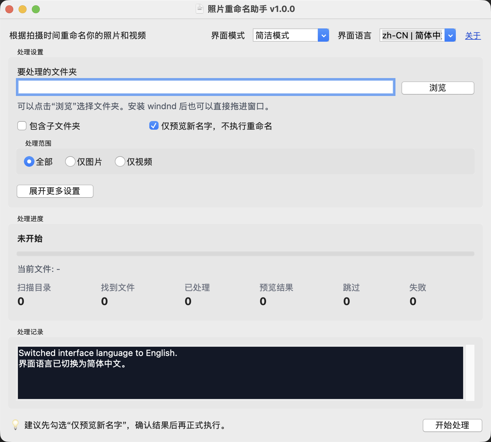

# photo-renamer

photo-renamer 是一个桌面图形界面工具，用于按照拍摄时间重命名照片和视频。



它会按以下顺序选择第一个可用的时间来源：

1. 文件名中可识别的时间戳，除非你关闭了这个选项。
2. 照片 EXIF `DateTimeOriginal`。
3. 视频元数据中的 `Creation date`。
4. 文件系统时间戳。

如果目标文件名已经存在，photo-renamer 会保留时间戳前缀，追加原始文件名，并在必要时继续添加数字后缀来避免重名。

`python 3.14`

## 快速开始

### 用户使用

可在这里下载最新版本：[Releases](https://github.com/gymgle/photo-renamer/releases)

当前发布版本为纯 GUI 版本：

- 双击可执行文件，或运行 `python photo_renamer.py` 打开程序。
- 应用提供简洁模式和专业模式、进度条、结果统计和错误摘要。
- 右上角可以在简体中文和 English 之间切换界面语言。
- 在 Windows 上，如果安装了 `windnd`，可以直接把文件夹或文件拖进窗口。
- 你可以选择把日志写入文件，并在任务完成后从应用内打开日志目录。

#### 使用方式

双击可执行文件，或运行 `python photo_renamer.py` 即可打开程序。

所有选项都在窗口中完成设置，不需要记命令。

你可以在窗口中完成这些操作：

- 选择要处理的文件夹。
- 自定义新的文件名格式。
- 在真正重命名前先预览结果。
- 限制只处理照片、只处理视频，或只处理指定格式。
- 包含子文件夹。
- 在需要时关闭“从文件名识别时间”。
- 即使文件名看起来已经正确，也强制重新命名。
- 把日志写入文件，可选择指定日志目录，也可以使用当前工作目录。
- 实时查看处理进度、当前文件、结果和错误信息。

支持的格式：

- 照片：`jpg`、`jpeg`、`heic`、`png`、`gif`、`nef`
- 视频：`mp4`、`mov`

Windows 拖拽支持：

- 把文件夹拖进窗口，可以自动填入目标目录。
- 把文件拖进窗口也可以，程序会自动使用该文件所在的文件夹。

#### 工作原理


photo-renamer 会按以下顺序选择时间：

1. 文件名中的时间，除非你关闭了这个选项。
2. 照片 EXIF `DateTimeOriginal`。
3. 视频元数据 `Creation date`。
4. 文件系统时间。

关于从文件名读取时间：

- 支持类似 `IMG_20240316_101520.jpg`、`VID_20240316_101520.mp4` 和 `20240316_101520666_iOS.heic` 这样的文件名。
- 文件名中的 3 位小数部分会被当作毫秒处理。
- “文件名时间偏移”只会影响从文件名中解析出来的时间。

预览模式：

- 开启预览后，程序只显示将要重命名成什么，不会真的修改文件。
- 预览模式和正式重命名使用相同的重名处理逻辑。

日志功能：

- 可以在窗口中开启日志写入文件。
- 如果没有单独选择日志目录，日志文件会写入当前工作目录。
- 任务完成后，可以使用 `打开日志目录` 按钮打开最近一次日志所在的目录。

#### 常见使用方式

1. 第一次使用：
   打开程序，选择文件夹，先保持“仅预览新名字，不执行重命名”为开启状态，先确认结果。
2. 如果文件名中的时间是 UTC：
   把文件名时间偏移设置为 `8` 或其他符合你本地时区的偏移值。
3. 如果只想处理照片：
   把处理范围切换为“仅图片”。
4. 如果只想处理某些格式：
   在格式筛选中输入 `jpg, png` 或 `heic, mov` 这样的值。
5. 如果要连子目录一起处理：
   开启“包含子文件夹”。
6. 如果确认预览结果没有问题：
   关闭“仅预览新名字，不执行重命名”，再运行一次进行正式重命名。
7. 如果有些文件已经带有时间戳前缀，但你仍然希望重新规范命名：
   开启“即使文件名看起来已正确也重新处理”。

### 开发说明

```shell
# 1. 克隆仓库
$ git clone https://github.com/gymgle/photo-renamer.git

# 2. 安装依赖
$ cd photo-renamer
$ pip3 install -r requirements.txt

# 3. 运行程序
$ python photo_renamer.py
```

说明：

- `windnd` 只在 Windows 下用于拖拽支持。
- 请不要使用 `ExifRead 3.0.0`，因为它存在 `exifread.heic.NoParser: hdlr` 问题。
- 在 macOS 上，所使用的 Python 解释器必须带有 Tk 支持。如果看到 `No module named '_tkinter'`，请改用 python.org 官方安装包，或者安装与你当前 Python 次版本对应的 Homebrew `python-tk` 包，例如 `python-tk@3.12`，然后用对应解释器运行 `photo_renamer.py`。

详情：<https://github.com/ianare/exif-py/issues/184>

### 如何打包

可以使用 PyInstaller 构建 Windows / Linux / macOS 可执行文件。

1. 安装 PyInstaller

   ```shell
   $ pip install pyinstaller
   ```

2. 准备 UPX（可选）

   从这里下载 UPX：<https://github.com/upx/upx/releases>

   Windows 下可把 `upx.exe` 放到项目根目录，或者 Python 虚拟环境目录中，例如 `venv\Scripts`。

3. 执行打包

   ```shell
   $ pyinstaller photo_renamer.spec
   ```

补充说明：

- Windows 使用 `assets/icon.ico`。
- macOS 需要提供 `assets/icon.icns`。当前 spec 会自动识别 macOS，使用 `.icns`，并构建 `.app` bundle，这样 Finder 和 Dock 才能正确识别图标。

打包后的 `photo-renamer` 可以在 `dist` 目录中找到。

### 文件系统时间兜底说明

- Windows：优先使用创建时间，其次是修改时间。
- macOS：优先使用 birth time，其次是修改时间。
- Linux：当嵌入元数据不可用时，使用修改时间，因为 `ctime` 不是可靠的创建时间。